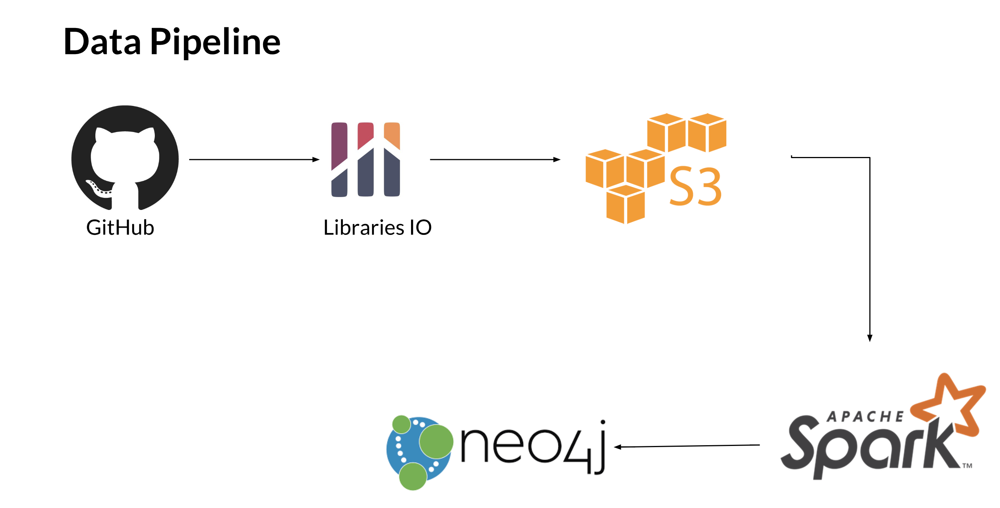

## Github as a Growth Monitor

GitHub has become a defacto standard for organizations to host code and manage a major chunk of development activities. It's vast community of active developers are a catalyst to the fast paced progress of product. Also, the global community helps to onboard anyone new to GitHub easily.

Along with being a Version Control Application GitHub provides a variety of features to track state of a project, plan milestones, track bugs, contributions and so on. As an organization evolves, the house keeping activities become overwhelmingly tedious and companies move to deploying separate tools for managing and tracking projects. Instead, GitHub Data could be leveraged to track project health, bug status and monitor progress. A majority of open source projects/in-house projects depend on other projects, Github data could be used to develop a dependency graph and across various projects and enable the developers to understand project outreach.

### Business Value

Such a tool can enable teams to focuss resources on projects that have wider outreach. It can be leveraged by business or executive team to priortize initiatives depending on the market. 

### Tech Stack

### Engineering Challenge

Parsing unstructured data and aggregating data related to import statements from different projects and mapping them together. Projects in different languages require different rules to extract version and dependency information.

### MVP

Query Bigquery and consume the data.
